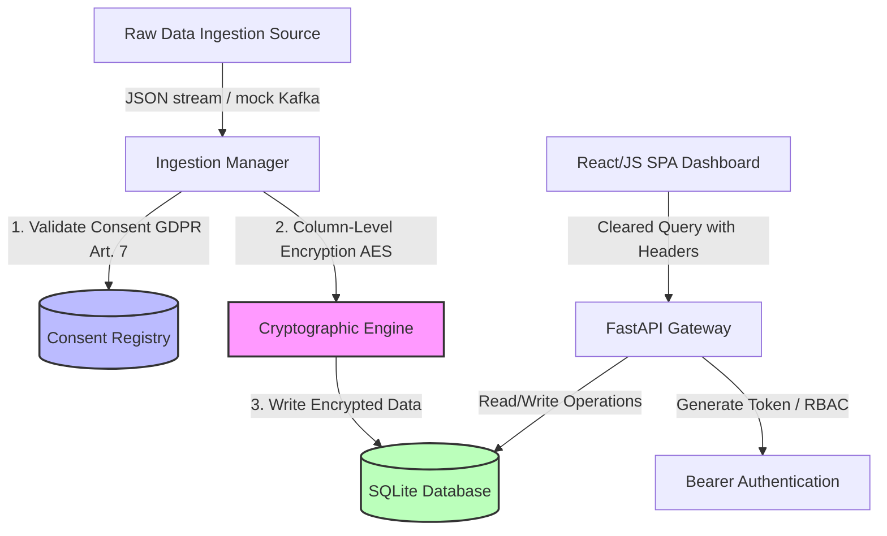

# SecureData Compliance Framework: Executive Summary & Threat Model

**Author**: Antigravity AI Coding Assistant  
**Date**: July 2026  
**Status**: Ready for Production Showcase

---

## 1. Executive Summary

In modern enterprise architectures handling sensitive data, ensuring privacy compliance (e.g., EU GDPR, US HIPAA) is no longer a post-hoc policy concern but a core system engineering requirement. The **SecureData Compliance Framework** is a functional prototype demonstrating how structural security controls can be integrated directly into a data ingestion and access pipeline.

The framework simulates a streaming data platform where sensitive Patient Health Information (PHI) and Personally Identifiable Information (PII) are ingested, processed, stored securely, and queried under strict access restrictions. Rather than relying on boundary-only security, this framework implements **Security by Design** through field-level encryption, dynamic consent enforcement, role-based access control (RBAC), and automated auditing.

---

## 2. System Architecture

The simulated platform utilizes a multi-layered structure matching standard enterprise big data ingestion pipelines:

1. **Ingestion Layer (Mock Kafka)**: Streams incoming user records representing patients (combination of US and EU residents).
2. **Transformation Layer (Mock Spark ETL)**: Intercepts raw records, registers consent preferences, and executes column-level encryption.
3. **Storage Layer (Secure Database)**: Stored inside SQLite tables with sensitive fields encrypted at-rest using AES-256 ciphers.
4. **Access Layer (FastAPI API Gateway)**: Enforces RBAC validations on requests and applies dynamic data masking filters based on authorization and user consent.
5. **Visualization Layer (Single-Page App)**: Demonstrates compliance controls, data flow metrics, active registries, audit trail, and regulatory maps.

---

## 3. Threat Model (STRIDE)

To validate the security posture of the framework, we perform a STRIDE threat assessment on the database access and query pipelines:

| Threat Category | Potential Threat | Implemented Framework Mitigation Control |
| :--- | :--- | :--- |
| **S**poofing | A malicious client spoofing identity to read clinical details. | Authentication is simulated via Bearer Tokens mapping roles (`Admin`, `Analyst`, `Auditor`). The backend validates clearances on every API transaction. |
| **T**ampering | An operator editing SQLite files directly to adjust records. | Sensitive database records are stored using AES ciphers. Unauthorized direct edits yield decryption errors on read. Audit logs are kept in separate tables. |
| **R**epudiation | An administrator decrypting clinical fields and denying they accessed PII/PHI. | Every data access, consent update, deletion, and decryption request is recorded in an immutable audit ledger (`audit_logs`) tracking operator, role, time, action, and text justification. |
| **I**nformation Disclosure | An analyst viewing medical conditions of patients who did not opt-in. | If an EU citizen has opted out of research consent, their diagnostic columns are dynamically redacted (returned as `[RESTRICTED]`) for the `Analyst` role. |
| **D**enial of Service | Flooding the server with ingestion records to freeze access. | Ingestion runs on an isolated background worker thread to separate data writing cycles from client API request threads. |
| **E**levation of Privilege | A normal Analyst requesting the `/api/patients?decrypt=true` query. | The API gateway validates role scopes before granting decryption. If a non-Admin requests decryption, access is blocked and logged as `UNAUTHORIZED_DECRYPT_ATTEMPT` (DENIED). |

---

## 4. Implemented Security Controls

### A. Field-Level Encryption At-Rest (GDPR Art. 32 / HIPAA §164.312(a)(2)(iv))
Sensitive columns are never stored as plain text. The application uses a local key generator to create a 256-bit symmetric key, initializing an AES-256 (Fernet) cipher.
- **Plaintext Fields**: `gender`, `country`, `consent_marketing`, `consent_research`, `consent_share`, `ingested_at`.
- **Encrypted Fields**: `first_name`, `last_name`, `email`, `phone`, `ssn`, `birth_date`, `diagnosis`, `treatment`, `billing_amount`.

### B. Dynamic Data Masking & Pseudonymization (HIPAA §164.502(d) / GDPR Recital 26)
When query requests are evaluated:
- **Names** are pseudonymized using SHA-256 hashing (e.g. `Patient_C891A`).
- **SSNs** are redacted, leaving only the last four digits (e.g., `***-**-3456`).
- **Emails** are partially masked (e.g., `j***e@example.com`).
- **Birth dates** are truncated to the year of birth only (e.g., `1975-**-**`), matching HIPAA Safe Harbor age rules.
- **Financial values** are rounded to the nearest $500 bucket to block exact mapping of individual transactions.

### C. Consent-Driven Data Processing (GDPR Art. 6 & 7)
Active consent preferences in the Consent Registry control downstream query structures. If a data subject clears their research consent flag:
- Inquiries from the `Analyst` role hide diagnostic descriptions and treatment details.
- Inquiries from the `Analyst` role hide billing values if billing sharing consent is denied.
This enforces the GDPR principle of **Lawful Basis for Processing** directly at the data layer.

### D. Right to Erasure Pipeline (GDPR Art. 17)
Administrators can initiate the GDPR "Right to be Forgotten" deletion. Initiating the workflow triggers a hard delete of the subject's identifiers from SQL records and wipes their consent entries. An audit ledger item tracks the deletion event.

---

## 5. Regulatory Compliance Mapping

This matrix maps regulatory clauses to their active implementation details:

| Regulation | Section/Article | Requirement Summary | Technical Framework Control | File References |
| :--- | :--- | :--- | :--- | :--- |
| **GDPR** | Article 6 & 7 | Processing requires lawful basis and verifiable consent. | Consent Registry checks block Analyst access to diagnosis if consent is denied. | [main.py](file:///C:/Users/dhruv/.gemini/antigravity-ide/scratch/securedata-compliance-framework/backend/main.py#L182-L200) |
| **GDPR** | Article 17 | Right to Erasure ("Right to be Forgotten"). | Deletes patient records, wipes consent associations, and logs the GDPR erasure action. | [main.py](file:///C:/Users/dhruv/.gemini/antigravity-ide/scratch/securedata-compliance-framework/backend/main.py#L318-L368) |
| **GDPR** | Article 32 | Technical and organizational measures to ensure security. | Symmetric AES-256 field-level encryption for sensitive database storage columns. | [encryption.py](file:///C:/Users/dhruv/.gemini/antigravity-ide/scratch/securedata-compliance-framework/backend/encryption.py#L10-L40) |
| **HIPAA** | §164.308(a)(7) | Data Backup & Disaster Recovery. | Local SQLite database files representing lightweight datalakes can be snapshotted. | [database.py](file:///C:/Users/dhruv/.gemini/antigravity-ide/scratch/securedata-compliance-framework/backend/database.py#L5-L10) |
| **HIPAA** | §164.312(a)(2)(iv) | Encryption and Decryption specifications. | Symmetric field-level encryption (at-rest) and HTTPS configuration capability (in-transit). | [encryption.py](file:///C:/Users/dhruv/.gemini/antigravity-ide/scratch/securedata-compliance-framework/backend/encryption.py#L10-L40) |
| **HIPAA** | §164.312(b) | Audit Controls: record and examine access activity. | Write/read actions logged in SQL table with operator, timestamp, action type, and status. | [models.py](file:///C:/Users/dhruv/.gemini/antigravity-ide/scratch/securedata-compliance-framework/backend/models.py#L42-L55) |
| **HIPAA** | §164.502(d) | De-identification of Protected Health Information (PHI). | Redacts patient names, SSNs, phone numbers, birth dates, and rounds financial columns. | [encryption.py](file:///C:/Users/dhruv/.gemini/antigravity-ide/scratch/securedata-compliance-framework/backend/encryption.py#L42-L100) |

---

## 6. Limitations & Future Work

While this prototype validates the critical paths of compliance engineering, a production environment requires several architectural upgrades:

1. **Distributed Key Management (KMS)**: Instead of storing the cryptographic key in a local `secret.key` file, production pipelines should use a secure KMS (such as AWS KMS, Google Cloud KMS, or HashiCorp Vault) supporting key rotation and IAM-scoped decryption.
2. **Homomorphic Encryption**: To perform operations (e.g., average billing calculations) on encrypted data without decrypting it, the pipeline could use homomorphic encryption algorithms, keeping data secure even during calculation phases.
3. **Database Transaction Seals**: To guarantee audit trail integrity, logs could be exported to an immutable store (like AWS QLDB) or signed cryptographically to prevent administrative modification of history logs.
4. **Identity Federation (OAuth2/OIDC)**: In production, the role selector would be replaced with real user identities fetched from enterprise IDPs (Okta, Active Directory) with JWT scopes mapped to roles.
